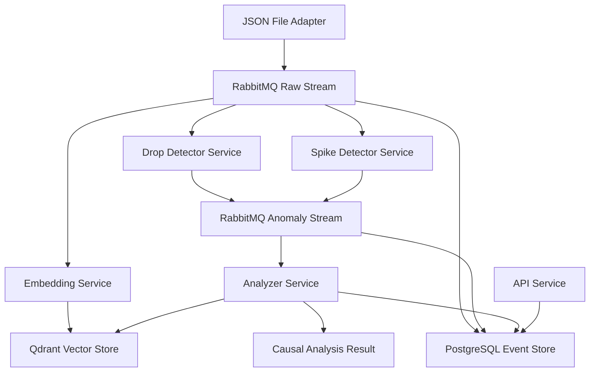

# SEZRA

SEZRA is a hyper-decoupled event-driven causal analysis platform.

The goal of SEZRA is to correlate anomalies in structured telemetry with semantically related contextual events from completely different data sources.

SEZRA combines:

- Event-driven architecture
- Semantic vector search
- Context retrieval
- Independent anomaly detectors
- Fully asynchronous processing

---

# Architecture Overview



Core technologies:

- RabbitMQ
- Qdrant
- PostgreSQL
- SentenceTransformers
- Docker Compose
- Python microservices

---

# Core Principles

- Hyper-decoupled architecture
- Event-driven communication
- Domain agnostic design
- Independent detector services
- Semantic causal retrieval
- Context-source agnostic ingestion
- Fully asynchronous pipeline

---

# Services

## json-file-adapter

Reads JSON files and publishes normalized events into the raw event stream.

## drop-detector-service

Detects downward metric anomalies.

Example:

```text
78 → 62
```

## spike-detector-service

Detects upward spike anomalies.

Example:

```text
180 → 420
```

## embedding-service

Generates vector embeddings and stores them in Qdrant.

## analyzer-service

Semantically retrieves contextual events related to anomalies and creates causal analysis results.

## event-store-service

Stores all event envelopes in PostgreSQL.

## api-service

Provides API access to stored events and analysis results.

---

# Environment Configuration

Create a `.env` file:

```env
RABBITMQ_HOST=rabbitmq
RABBITMQ_PORT=5672
RABBITMQ_USER=sezra
RABBITMQ_PASSWORD=sezra

POSTGRES_HOST=postgres
POSTGRES_PORT=5432
POSTGRES_USER=sezra
POSTGRES_PASSWORD=sezra
POSTGRES_DB=sezra

QDRANT_HOST=qdrant
QDRANT_PORT=6333
```

---

# Start SEZRA

School-grade demo profile:

```bash
docker compose --profile drop-detectors up --build
```

DevOps spike demo profile:

```bash
docker compose --profile spike-detectors up --build
```

---

# Reset Demo State

Before running demos:

```bash
./scripts/reset-demo-data.sh
```

This clears:

- PostgreSQL event store
- Qdrant collection
- Processed demo files

---

# Demo 1 — School Grades

Educational telemetry correlated with contextual email communication.

## Context Event

```text
"Starting next Monday, school begins at 7:30 AM instead of 8:00 AM."
```

## Observation Events

Baseline:

```text
math_test_average = 78
```

Anomaly:

```text
math_test_average = 62
```

## Run Demo

```bash
./scripts/demo-school.sh
```

## Expected Result

```text
SEZRA detected an anomaly for metric "math_test_average".
The value changed from 78.0 to 62.0.
The most relevant contextual event found was:
"Starting next Monday, school begins at 7:30 AM instead of 8:00 AM."
```

---

# Demo 2 — DevOps / Jenkins Deployment

Infrastructure telemetry correlated with deployment events.

## Context Event

```text
"Jenkins deployed checkout-api version 1.12.0 with new request logging middleware."
```

## Observation Events

Baseline:

```text
api_latency_ms = 180
```

Spike anomaly:

```text
api_latency_ms = 420
```

## Run Demo

```bash
./scripts/demo-devops.sh
```

## Expected Result

```text
SEZRA detected an anomaly for metric "api_latency_ms".
The value changed from 180.0 to 420.0.
The most relevant contextual event found was:
"Jenkins deployed checkout-api version 1.12.0 with new request logging middleware."
```

---

# Why SEZRA?

Traditional monitoring systems detect anomalies.

SEZRA attempts to explain them.

Instead of only detecting that something changed, SEZRA searches semantically related contextual information across independent event streams.

The platform is intentionally domain agnostic:

- education
- DevOps
- IoT
- finance
- manufacturing
- healthcare
- CRM systems
- support systems
- external APIs

All domains use the same architecture and pipeline.

---

# Current MVP State

The current MVP demonstrates:

- Event-driven microservice architecture
- Independent detector services
- Semantic vector retrieval
- Context correlation
- Human-readable causal summaries
- Multiple domain scenarios
- Repeatable demo execution

---

# Future Direction

Planned future improvements:

- Statistical anomaly detection
- Rolling baselines
- Z-score detectors
- Time-window analysis
- Multiple related contexts
- Confidence scoring
- Streaming ingestion adapters
- Jira integration
- Jenkins integration
- CRM integrations
- LLM-assisted causal summaries
- Real-time dashboards

---

# Philosophy

SEZRA is intentionally designed around:

```text
small services
simple responsibilities
event-driven communication
minimal coupling
maximum replaceability
```

The architecture prioritizes:

- scalability
- replaceability
- observability
- independent evolution
- domain flexibility