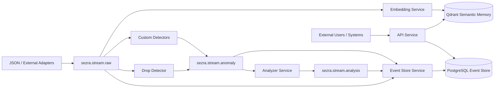

# SEZRA
### *the sensing one*

> Your systems already know what happened.  
> SEZRA asks why.

---

Most monitoring tools will tell you that math test scores dropped on Tuesday.

None of them will tell you it's because the school changed its start time to 7:30 AM the week before — and that information was sitting in an email the whole time.

**That gap — between *detecting* an event and *understanding* its cause — is what SEZRA is built to close.**

---

## The Problem Nobody Is Solving Well

Modern systems generate enormous amounts of isolated data:
metrics, logs, emails, ERP events, sensor telemetry, support tickets, business KPIs.

Most monitoring systems answer: **what happened?**  
Most LLM wrappers answer: **what does this data say?**

Neither answers the question that actually matters:

```
WHY did it happen?
```

The answer is almost never in a single data source.  
It lives in the *relationship between signals* — across time, across systems, across context.

That's a causal reasoning problem. Not a search problem. Not a summarization problem.

---

## What SEZRA Does

SEZRA ingests raw telemetry, logs, metrics, documents, emails, and external signals —  
detects anomalies, builds semantic memory, and reconstructs plausible causal chains.

```
Observe reality           →  raw event ingestion from any source
Detect anomalies          →  pluggable statistical detectors
Search context            →  semantic memory via vector embeddings
Reconstruct causality     →  causal chain analysis across correlated events
Assist investigation      →  LLM reasoning on top of structured evidence
```

The LLM is the **last step** — not the whole pipeline.  
The 80% that makes it reliable happens before it.

---

## A Concrete Example

A school reports a sharp drop in 8th grade math scores.

```json
{ "metric": "math_test_average", "grade_level": 8, "value": 62 }
```

SEZRA detects the deviation against the baseline.  
Simultaneously, semantic memory contains an email ingested three days earlier:

```
Starting next Monday, school begins at 7:30 AM instead of 8:00 AM.
```

SEZRA surfaces the semantic proximity between these two events.  
A causal hypothesis emerges — not from hallucination, but from correlated evidence already in your data.

**This is the difference between a monitoring tool and a reasoning engine.**

---

## Architecture



Three event streams. One causal story.

| Stream | Purpose |
|---|---|
| `sezra.stream.raw` | Normalized incoming data from any adapter |
| `sezra.stream.anomaly` | Anomaly events from detector services |
| `sezra.stream.analysis` | Causal analysis results |

---

## Current Capabilities (MVP)

**Durable Event Store**  
All events persisted in PostgreSQL with full envelope — `event_id`, `event_type`, `source`, `occurred_at`, `correlation_id`, `causation_id`, `payload`.

**Semantic Memory**  
Embeddings stored in Qdrant via `sentence-transformers/all-MiniLM-L6-v2`. Context retrieval that understands meaning, not just keywords.

**Pluggable Detector Architecture**  
Detectors are independent microservices. Any service that listens to `sezra.stream.raw` and publishes to `sezra.stream.anomaly` is a detector. Drop detection, threshold, z-score, ML-based — build and plug in independently.

**Semantic Search API**  
```bash
curl "http://localhost:8000/semantic/search?query=math%20grades%20dropped"
```

---

## Current Services

| Service | Purpose |
|---|---|
| `json-file-adapter` | Ingest JSON files into raw event stream |
| `event-store-service` | Persist all events to PostgreSQL |
| `drop-detector-service` | Detect value drops against baseline |
| `anomaly-detector-service` | Threshold-based detection |
| `analyzer-service` | Produce causal analysis events |
| `embedding-service` | Generate and store vector embeddings in Qdrant |
| `api-service` | REST API and semantic search |

---

## Quick Start

```bash
git clone https://github.com/orhangezginci/sezra.git
cd sezra

# Core stack
docker compose up

# With drop detection
docker compose --profile drop-detectors up
```

---

## REST API

```bash
# Health
curl http://localhost:8000/health

# All events
curl http://localhost:8000/events

# By type
curl http://localhost:8000/events/type/AnomalyDetected

# By correlation ID (trace a causal chain)
curl http://localhost:8000/events/correlation/<correlation_id>

# Semantic search
curl "http://localhost:8000/semantic/search?query=math%20grades%20dropped"
```

---

## Intelligence Progression

SEZRA is designed to evolve incrementally — each stage testable and useful on its own:

```
rules
→ statistical detection
→ semantic retrieval
→ causal reconstruction
→ LLM-assisted reasoning
```

No magic. No black boxes. Every layer observable and replaceable.

---

## Stack

Python · FastAPI · RabbitMQ · PostgreSQL · SQLAlchemy · Alembic · Qdrant · SentenceTransformers · Docker Compose

---

## Status

Active experimental MVP. Architecture evolving in small, deliberate steps.

---

## License

MIT
