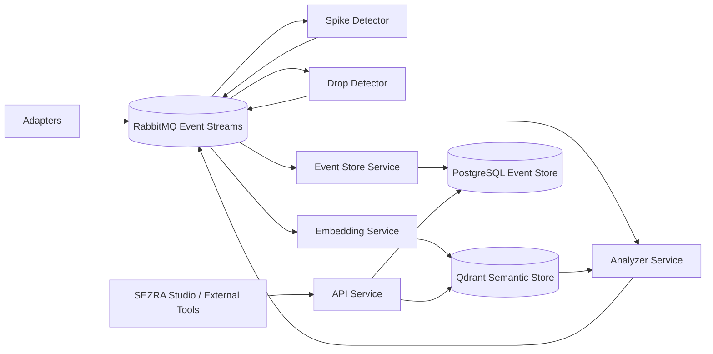

# SEZRA

**Operational events are meaningless in isolation. SEZRA turns them into context-aware reasoning.**

SEZRA is a semantic event reasoning engine built for modern distributed systems.

Instead of only detecting anomalies, SEZRA correlates operational events with surrounding contextual signals to generate human-readable analysis and semantic operational insight.

Feed SEZRA with metrics, logs, context events, CI/CD events, infrastructure signals, or custom business events — and let semantic reasoning emerge across your event streams.

---

# Clone. Run. Experience SEZRA.

```bash
git clone https://github.com/orhangezginci/sezra.git
cd sezra
docker compose up -d
```

Run the demo:

```bash
./scripts/demo-metric-context.sh
```

Fetch the latest generated analysis:

```bash
curl http://localhost:8000/analyses/latest
```

Example output:

```text
SEZRA Analysis

Anomaly:
API latency spiked from 178ms to 420ms.

Likely context:
CPU usage for checkout-api was 94%.

Interpretation:
The latency spike may be related to high CPU usage on the same service.
```

---

# What Is SEZRA?

SEZRA is not just another anomaly detector.

SEZRA is built around the idea that operational events gain meaning through semantic context.

Instead of treating events as isolated signals, SEZRA correlates anomalies with surrounding operational context to generate higher-level operational understanding.

SEZRA is designed to work across:

* metrics
* logs
* infrastructure signals
* CI/CD events
* operational telemetry
* custom business events
* semantic context streams

SEZRA can run:

* locally with Docker Compose
* fully headless
* inside enterprise environments
* inside CI/CD pipelines
* behind custom APIs
* inside Kubernetes platforms
* with Bash scripts
* with Python automation
* through future SEZRA Studio workflows

---

# Architecture

SEZRA is intentionally simple.

No shared runtime library.
No hidden service coupling.
No mandatory SDK.

Every service does one thing:

```text
consume events
process events
publish events
```

That is the whole contract.



SEZRA services are independently deployable and replaceable.

A detector can be written in Python.
An adapter can be written in Go.
An enricher can be written in Rust.
A workflow can be controlled by Bash, Jenkins, an enterprise platform, or the future SEZRA Studio.

As long as a component speaks SEZRA events, it belongs in the system.

---

# Current MVP Features

* Semantic anomaly analysis
* Context-aware event correlation
* Human-readable operational reasoning
* RabbitMQ event fabric
* PostgreSQL event store
* Qdrant semantic vector search
* REST API
* Dead-letter event persistence
* Failure classification
* Envelope validation
* Runtime health checks
* Docker Compose deployment
* Headless operation
* Hyper-decoupled services

---

# Example Use Cases

* Correlate application latency spikes with infrastructure signals
* Enrich operational telemetry with semantic context
* Analyze CI/CD failures
* Process business events semantically
* Run headless operational reasoning pipelines
* Build enterprise operational intelligence workflows
* Integrate semantic reasoning into existing architectures

---

# SEZRA Studio

SEZRA Studio will become the official visual reference implementation for SEZRA.

Studio is not the engine itself.

SEZRA Studio is the visual manifestation of the SEZRA engine philosophy:

* event-driven
* hyper-decoupled
* workflow-oriented
* semantic-first
* infrastructure-agnostic

SEZRA Studio will allow users to:

* build pipelines visually
* attach adapters and detectors
* configure semantic workflows
* inspect event flows
* analyze reasoning chains
* manage context sources
* orchestrate operational intelligence visually

The SEZRA engine itself remains fully usable without Studio.

---

# Roadmap

Near-term goals:

* Statistical baseline detectors
* Additional adapters
* Additional context enrichers
* Better semantic reasoning
* Improved API endpoints
* Public demo environment
* Initial SEZRA Studio foundation

Long-term vision:

* Visual pipeline orchestration
* Detector/adapter marketplace
* Plugin ecosystem
* Distributed deployment support
* Advanced reasoning services
* Enterprise integrations
* Workflow automation ecosystem

---

# Development Status

SEZRA is currently in active MVP-stage development.

The current focus is:

* engine stability
* semantic reasoning quality
* operational hardening
* architecture clarity
* public usability
* SEZRA Studio foundations

---

# Philosophy

SEZRA is designed around a simple idea:

Operational systems already produce enormous amounts of events.

The missing piece is semantic understanding.

SEZRA exists to transform isolated operational signals into contextual operational reasoning.
