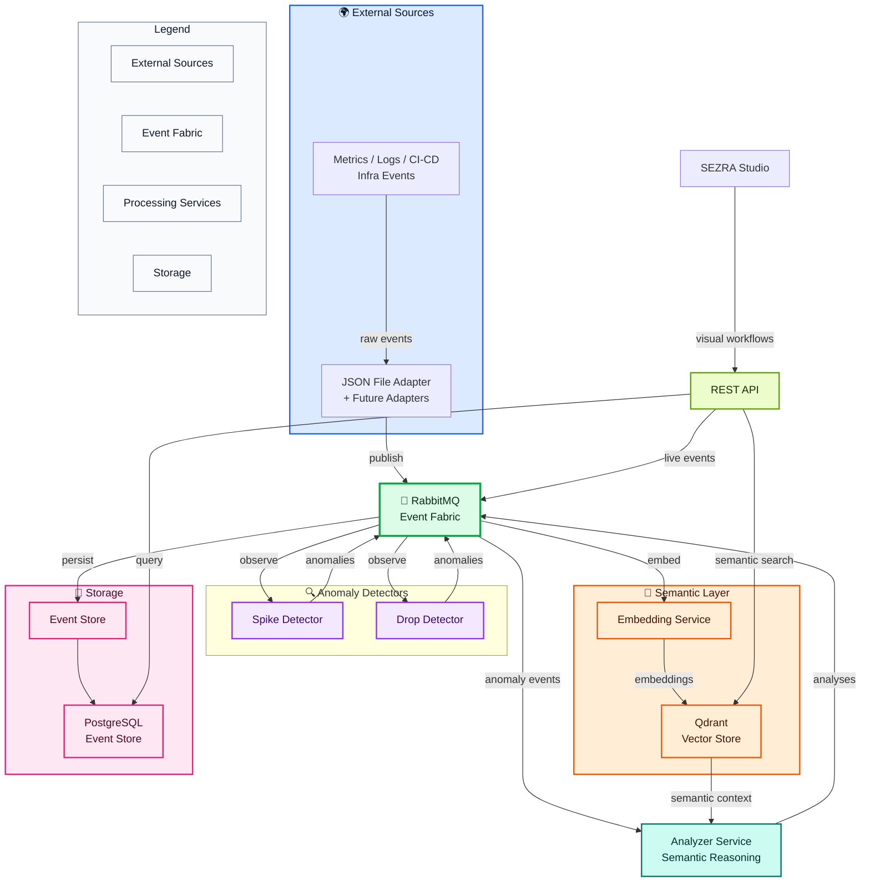

# SEZRA

**Operational events are meaningless in isolation. SEZRA turns them into context-aware reasoning.**

SEZRA is a semantic event reasoning engine built for modern distributed systems.

Instead of only detecting anomalies, SEZRA correlates operational events with surrounding contextual signals to generate human-readable analysis and semantic operational insight.

Feed SEZRA with metrics, logs, context events, CI/CD events, infrastructure signals, or custom business events — and let semantic reasoning emerge across your event streams.

---

# Clone. Run. Experience SEZRA.

https://github.com/user-attachments/assets/e697617a-ac33-48a5-bc0b-bd4c4ee9cde9

```bash
git clone https://github.com/orhangezginci/sezra.git
cd sezra
docker compose up -d
```

Run the demo:

```bash
./scripts/demo-metric-context.sh
```

Fetch the latest generated analysis:

```bash
curl http://localhost:8000/analyses/latest
```

**Example output:**

```text
SEZRA Analysis

Anomaly:
API latency spiked from 178ms to 420ms.

Likely context:
CPU usage for checkout-api was 94%.

Interpretation:
The latency spike may be related to high CPU usage on the same service.
```

---

# What Is SEZRA?

SEZRA is not just another anomaly detector.

It is built around the idea that operational events gain meaning through **semantic context**.

Instead of treating events as isolated signals, SEZRA correlates anomalies with surrounding operational context to generate higher-level operational understanding.

SEZRA works across:

* Metrics
* Logs
* Infrastructure signals
* CI/CD events
* Operational telemetry
* Custom business events
* Semantic context streams

It runs locally with Docker Compose, fully headless, in Kubernetes, inside CI/CD pipelines, or as part of larger platforms.

---

# Architecture

SEZRA is intentionally simple and **hyper-decoupled**.

**No shared runtime library. No hidden coupling. No mandatory SDK.**

Every service follows the same contract:

```text
consume events → process events → publish events
```



SEZRA services are independently deployable and replaceable.

A detector can be written in Python, an adapter in Go, an enricher in Rust — as long as they speak SEZRA events, they belong in the system.

---

# Current MVP Features

* Semantic anomaly analysis
* Context-aware event correlation
* Human-readable operational reasoning
* RabbitMQ event fabric with proper envelopes
* PostgreSQL event store
* Qdrant semantic vector search
* REST API
* Dead-letter event persistence
* Failure classification
* Envelope validation
* Runtime health checks
* Docker Compose deployment
* Hyper-decoupled services

---

# Example Use Cases

* Correlate application latency spikes with infrastructure signals
* Enrich operational telemetry with semantic context
* Analyze CI/CD failures
* Process business events semantically
* Run headless operational reasoning pipelines

---

# SEZRA Studio

SEZRA Studio will be the official visual interface for the SEZRA engine — a visual pipeline builder that follows the same hyper-decoupled and semantic-first philosophy.

The engine itself remains fully usable without Studio.

---

# Roadmap

## Near-term

* Statistical baseline detectors
* Additional adapters & enrichers
* Improved semantic reasoning
* Public demo environment

## Long-term

* Visual pipeline orchestration (Studio)
* Plugin ecosystem
* Advanced reasoning services
* Enterprise integrations

---

# Philosophy

Operational systems already produce enormous amounts of events.

The missing piece is **semantic understanding**.

SEZRA exists to transform isolated operational signals into contextual, human-understandable operational reasoning.
